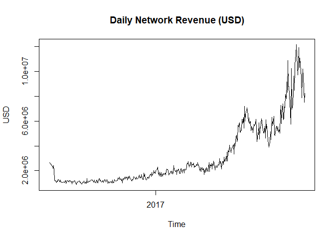

Bitcoin Mining - Backtest and Predictions
================

This project consists of two sub-parts:

-   Bitcoin mining - historical backtest example.
-   Bitcoin mining - Future profitability predictions (based on trend regressions).

Historical Backtest
===================

Assumptions:

-   Five antminer S9 ASIC Miners bought at 2300 USD per miner in july 2016.
-   Energy efficient mining in Iceland at 5 cents per kwh.
-   Initial 500USD operational expense (shipping, setup costs, etc..).

Relevant network data and mining results are illustrated below.

``` r
source("config/Config.R")

BitcoinMiningBacktest(miner.price    = 2300,
                      fixed.cost     = 500,
                      miner.power    = 1247,
                      miner.hashrate = 13, 
                      nr.miners      = 5,
                      cost.kwh       = 0.05,
                      cost.var.daily = 0,
                      backtest.start = "2016-07-01")
```

    ## [1] "Fixed Initial Investment: 12000USD"
    ## [1] "Daily Electricity Cost: 7.482USD"
    ## [1] "Additional Daily Costs: 0USD"
    ## [1] "Initial Hashrate of 65TH/s represents 0.00397631401502343% of the total network hashrate (1634679.75TH/s) on 2016-07-01"
    ## [1] "Initial Hashrate of 65TH/s represents 0.000787267977668502% of the total network hashrate (8256400.85TH/s) on 2017-09-15"



    ## [1] "Mine and sell strategy - statistics:"
    ## [1] "ROI reached on 2017-05-08 after 312 days."
    ## [1] "Total Expenditures on 2017-09-15: 15307.04USD"
    ## [1] "Total Revenue on 2017-09-15: 23612.76USD"
    ## [1] "Total Profit on 2017-09-15: 8305.72USD after 442 days."


    ## [1] "Buy and Hold versus Mine and Hold"
    ## [1] "For fair comparison, buy and hold strategy is performed as follows:"
    ## [1] "buy 17.773BTC using 12000USD on 2016-07-01"
    ## [1] "Use daily Variable mining Costs to buy more BTC at market price"
    ## [1] ""
    ## [1] "Total Expenditures over time interval: 15307.04USD"
    ## [1] ""
    ## [1] "Buy and Hold:"
    ## [1] "Selling 21.0889 coins at a price of 3774.26 USD on 2017-09-15 for 79595.02 USD"
    ## [1] "Total Profit: 64287.97 USD"
    ## [1] ""
    ## [1] "Mine and Hold:"
    ## [1] "Selling 21.5725 coins at a price of 3774.26 USD on 2017-09-15 for 81420.04 USD"
    ## [1] "Total Profit: 66112.99 USD"
    ## [1] ""
    ## [1] "Mine and hold versus Buy and hold - Additional profit: 1825.02USD"

Future Profitability Predictions
================================

The `BitcoinMiningBacktest` expects future bitcoin price predictions, total network hashrate predictions and total network revenue predictions as input when it's run in `forward.mode`.

Assumptions:

-   Use exponential regression to predict the bitcoin price trend.
-   Use exponential regression to predict the total network revenue trend.
-   Use loess regression with degree 1 to predict the future hashrate trend.
-   Miners sell at around 1288 per unit.
-   Predict up to 500 days ahead.
-   Other assumptions are the same as before.

The section below illustrates the results of the individual trend regressions followed by the mining profitability forward simulation (using the predicted trendvalues as input).

### Bitcoin Price (Exponential Regression)

``` r
date.start <- "2011-01-01"
btc.price <- FetchBTCInfo(param           = "market-price",   
                          data.identifier = "btc.close", 
                          date.start      = date.start)

btc.predictions <- SimpleLogTrendRegression(data = btc.price, 
                                            data.identifier = "BTC-price", 
                                            regression.type = "exponential",
                                            data.frequency  = "daily",
                                            nr.future       = 500, 
                                            plot.2sd.log    = TRUE, 
                                            plot.2sd.levels = FALSE)
```


### Total Network Mining Revenue (Exponential Regression)

``` r
## Total network mining revenue (coinbase + transaction) - Exponential regression.
mining.revenue.usd <- FetchBTCInfo(param           = "miners-revenue", 
                                   data.identifier = "mining.revenue",
                                   date.start      = date.start)

revenue.predictions <- SimpleLogTrendRegression(data = mining.revenue.usd, 
                                            data.identifier = "Mining.Revenue", 
                                            regression.type = "exponential",
                                            data.frequency  = "daily",
                                            nr.future       = 500, 
                                            plot.2sd.log    = TRUE, 
                                            plot.2sd.levels = FALSE)
```


### Total Network Hashrate (Loess Regression)

``` r
# Hashrate trend predictions (Loess, degree = 1)
hashrate.total <- FetchBTCInfo(param           = "hash-rate", 
                               data.identifier = "mining.hashrate",
                               date.start      = date.start)

hashrate.predictions <- SimpleLogTrendRegression(data = hashrate.total, 
                                                 data.identifier = "Network Hashrate",
                                                 regression.type = "loess",
                                                 data.frequency  = "daily",
                                                 loess.degree    = 1,
                                                 nr.future       = 500, 
                                                 plot.2sd.log    = TRUE, 
                                                 plot.2sd.levels = FALSE)
```


### Mining Profitability Simulation

``` r
BitcoinMiningBacktest(miner.price     = 1288,
                      fixed.cost      = 500,
                      miner.power     = 1247,
                      miner.hashrate  = 13,
                      nr.miners       = 5,
                      cost.kwh        = 0.05,
                      cost.var.daily  = 0,
                      forward.mode    = TRUE,
                      bitcoin.price.predictions   = btc.predictions$level.trend,
                      network.revenue.predictions = revenue.predictions$level.trend,
                      network.hashrate.predictions = hashrate.predictions$level.trend)
```

    ## [1] "Fixed Initial Investment: 6940USD"
    ## [1] "Daily Electricity Cost: 7.482USD"
    ## [1] "Additional Daily Costs: 0USD"
    ## [1] "Initial Hashrate of 65TH/s represents 0.000717067178569253% of the total network hashrate (9064701.59876692TH/s) on 2017-09-16"
    ## [1] "Initial Hashrate of 65TH/s represents 0.000104808625211886% of the total network hashrate (62017796.5969813TH/s) on 2019-01-28"


    ## [1] "Mine and sell strategy - statistics:"
    ## [1] "ROI reached on 2018-03-25 after 191 days."
    ## [1] "Total Expenditures on 2019-01-28: 10681USD"
    ## [1] "Total Revenue on 2019-01-28: 17536.85USD"
    ## [1] "Total Profit on 2019-01-28: 6855.85USD after 500 days."


    ## [1] "Buy and Hold versus Mine and Hold"
    ## [1] "For fair comparison, buy and hold strategy is performed as follows:"
    ## [1] "buy 1.9715BTC using 6940USD on 2016-07-01"
    ## [1] "Use daily Variable mining Costs to buy more BTC at market price"
    ## [1] ""
    ## [1] "Total Expenditures over time interval: 10681USD"
    ## [1] ""
    ## [1] "Buy and Hold:"
    ## [1] "Selling 2.5388 coins at a price of 14585.72 USD on 2019-01-28 for 37030.27 USD"
    ## [1] "Total Profit: 26349.27 USD"
    ## [1] ""
    ## [1] "Mine and Hold:"
    ## [1] "Selling 2.9078 coins at a price of 14585.72 USD on 2019-01-28 for 42412.69 USD"
    ## [1] "Total Profit: 31731.69 USD"
    ## [1] ""
    ## [1] "Mine and hold versus Buy and hold - Additional profit: 5382.42USD"

Donations
---------

If you find this software useful and/or you would like to see additional extensions, feel free to donate some crypto:

-   BTC: 1QHtZLZ15Cmj4FPr5h5exDjYciBDhh7mzA
-   LTC: LhKf6MQ7LY1k8YMaAq9z3APz8kVyFX3L2M
-   ETH: 0x8E44D7C96896f2e0Cd5a6CC1A2e6a3716B85B479
-   DASH: Xvicgp3ga3sczHtLqt3ekt7fQ62G9KaKNB

Or preferably, donate some of my favorite coins :)

-   GAME: GMxcsDAaHCBkLnN42Fs9Dy1fpDiLNxSKX1
-   WAVES: 3PQ8KFdw2nWxQATsXQj8NJvSa1VhBcKePaf

Licensing
---------

Copyright 2017 Essential Data Science Consulting ltd. ([EssentialQuant.com](http://essentialquant.com "EssentialQuant") / <jellenvermeir@essentialquant.com>). This software is copyrighted under the MIT license: View added [LICENSE](./LICENSE) file.
